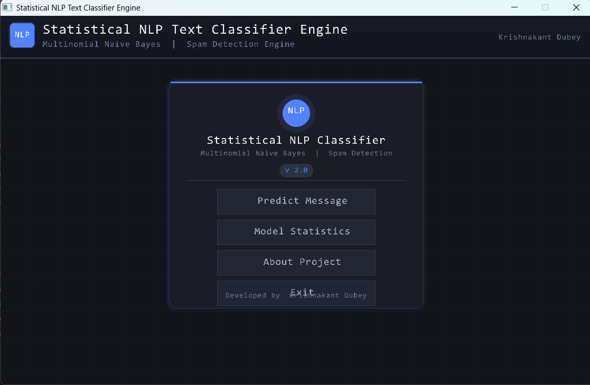
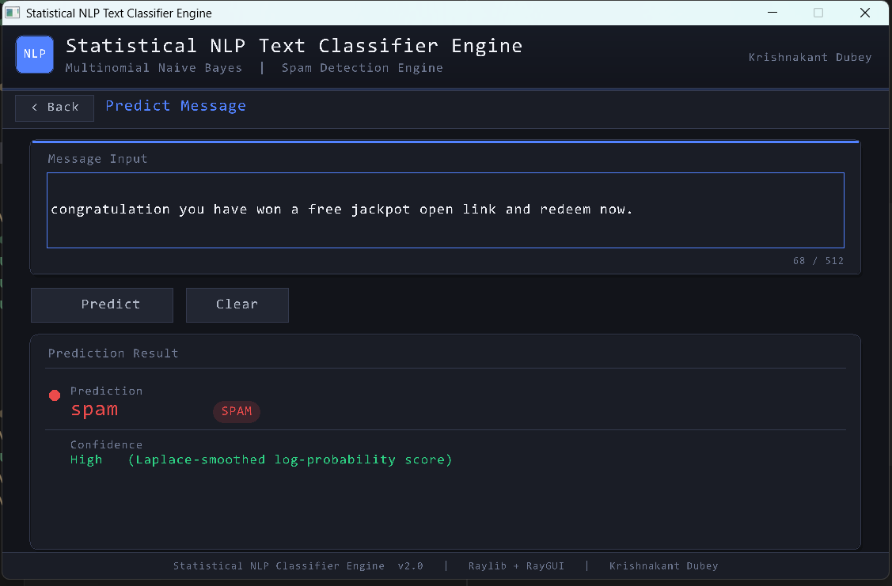
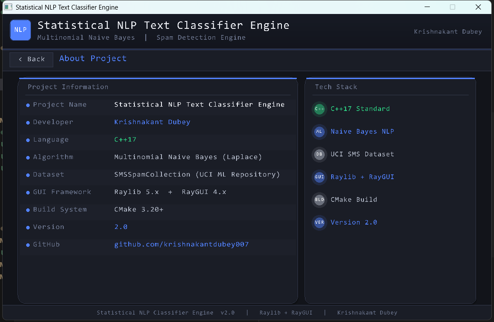

# Statistical NLP Text Classifier Engine

> **Version 2.0** — Professional Multi-Page Desktop GUI + Multinomial Naive Bayes Spam Detector

A modular **C++17** implementation of a **Statistical Natural Language Processing (NLP)** based SMS Spam Detection System.
Built from scratch — no external ML or NLP libraries required.

[](https://en.cppreference.com/w/cpp/17)
[](https://www.raylib.com)
[](https://cmake.org)
[](./LICENSE)

---

## Table of Contents

- [Overview](#-overview)
- [GUI Screenshots](#-gui-screenshots)
- [Features](#-features)
- [Technologies](#-technologies)
- [Project Architecture](#-project-architecture)
- [Folder Structure](#-folder-structure)
- [Dataset](#-dataset)
- [Algorithm](#-algorithm)
- [Build Instructions](#-build-instructions)
- [How It Works](#-how-it-works)
- [Future Improvements](#-future-improvements)
- [Developer](#-developer)
- [License](#-license)

---

## 📖 Overview

This project classifies SMS messages as **Spam** or **Ham (Normal)** using the **Multinomial Naive Bayes** algorithm implemented entirely in Modern C++17.

**Version 2.0** adds a fully redesigned, professional **multi-page desktop GUI** built with **Raylib** and **RayGUI**, replacing the original console interface while keeping the backend completely untouched.

The classifier pipeline performs:

- Text preprocessing and lowercase normalization
- Punctuation stripping and tokenization
- Word frequency analysis per class
- Bayesian log-probability scoring
- Laplace (Add-One) smoothing for unseen words

---

## 📸 GUI Screenshots

> All screenshots reflect the **Version 2.0** GUI running on Windows.

### Main Menu



---

### Predict Message



---

### Model Statistics


---

### About Project



---

## ✨ Features

### Core Engine

| Feature | Status |
|---|---|
| Multinomial Naive Bayes classifier | ✅ |
| Laplace (Add-One) smoothing | ✅ |
| Log-probability scoring (numerical stability) | ✅ |
| Tokenizer with lowercase + punctuation removal | ✅ |
| TSV dataset loader (`DataLoader`) | ✅ |
| Vocabulary-based word frequency maps | ✅ |
| Model statistics getters | ✅ |

### GUI Application (v2.0)

| Feature | Status |
|---|---|
| Multi-page navigation (`currentPage` state machine) | ✅ |
| Main Menu with hero card layout | ✅ |
| Predict Message page with live TextBox | ✅ |
| SPAM / HAM result badge with colour coding | ✅ |
| Confidence indicator | ✅ |
| Character counter on input | ✅ |
| Model Statistics page with stat tiles | ✅ |
| Spam / Ham ratio bar with percentages | ✅ |
| About Project page (two-column layout) | ✅ |
| Exit Confirmation dialog with overlay | ✅ |
| Professional dark theme with surface hierarchy | ✅ |
| Gradient header bar | ✅ |
| Glow / accent border on focused input | ✅ |
| Shared header + footer across all pages | ✅ |
| Zero code duplication (helper functions) | ✅ |

---

## 💻 Technologies

| Category | Technology |
|---|---|
| **Language** | C++17 |
| **Standard Library** | STL (`vector`, `unordered_map`, `unordered_set`, `string`) |
| **GUI Framework** | [Raylib 5.x](https://www.raylib.com) + [RayGUI 4.x](https://github.com/raysan5/raygui) |
| **Build System** | CMake 3.20+ |
| **Algorithm** | Multinomial Naive Bayes |
| **NLP Techniques** | Tokenization, Laplace Smoothing, Log Probability |
| **Dataset** | UCI SMS Spam Collection |
| **Version Control** | Git + GitHub |
| **Platform** | Windows (MinGW / MSVC) |

---

## 🏗️ Project Architecture

```
                 SMS Dataset (TSV)
                        │
                        ▼
               ┌─────────────────┐
               │   DataLoader    │  Parses label + text from file
               └────────┬────────┘
                        │
                        ▼
               ┌─────────────────┐
               │   Tokenizer     │  Lowercase, strip punctuation, split
               └────────┬────────┘
                        │
                        ▼
               ┌─────────────────┐
               │   NaiveBayes    │  Train word frequencies, predict class
               └────────┬────────┘
                        │
              ┌─────────┴──────────┐
              ▼                    ▼
         Console App           GUI App
         (main.cpp)         (gui_main.cpp)
                              Raylib + RayGUI
                              5-Page Navigation
```

---

## 📁 Folder Structure

```text
Statistical-NLP-Classifier/
│
├── assets/
│   └── fonts/
│       └── consola.ttf            # Custom Consolas high-res typography asset
│
├── data/
│   └── SMSSpamCollection          # UCI tab-separated SMS dataset (5,574 messages)
│
├── include/
│   ├── DataLoader.hpp             # DataLoader class declaration
│   ├── Tokenizer.hpp              # Tokenizer class declaration
│   └── NaiveBayes.hpp             # NaiveBayes class declaration + stats getters
│
├── src/
│   ├── DataLoader.cpp             # TSV file parser
│   ├── Tokenizer.cpp              # Text normalization + tokenization
│   ├── NaiveBayes.cpp             # Training, prediction, Laplace smoothing
│   ├── main.cpp                   # Console application entry point (v1.0)
│   └── gui_main.cpp               # GUI application entry point (v2.0)
│
├── gui/
│   ├── raygui.h                   # RayGUI single-header library
│   ├── Theme.hpp                  # Colour palette declarations
│   └── Theme.cpp                  # Colour palette definitions
│
├── docs/
│   ├── Project-Journal.md         # Day-by-day development journal
│   └── screenshots/
│       ├── menu.png
│       ├── prediction.png
│       ├── statistics.png
│       └── about.png
│
├── tests/
│   └── mock_data.tsv              # Unit test dataset
│
├── build/                         # CMake build output (generated)
├── CMakeLists.txt                 # CMake build configuration
├── CppProperties.json             # VS/VS Code IntelliSense config
├── README.md
└── LICENSE
```

---

## 📂 Dataset

| Property | Value |
|---|---|
| **Name** | UCI SMS Spam Collection |
| **Source** | [UCI ML Repository](https://archive.ics.uci.edu/dataset/228/sms+spam+collection) |
| **Format** | Tab-separated (label `\t` text) |
| **Total Messages** | 5,574 |
| **Spam Messages** | 747 (13.4%) |
| **Ham Messages** | 4,827 (86.6%) |

---

## 🧠 Algorithm

This project implements the **Multinomial Naive Bayes** algorithm — a probabilistic text classification model that applies Bayes' Theorem with the naive independence assumption.

### Bayes' Theorem

```
P(Class | Message) ∝ P(Class) × ∏ P(Word | Class)
```

### Log-Probability Form (used in code)

```
log P(spam | msg) = log P(spam) + Σ log P(word | spam)
log P(ham  | msg) = log P(ham)  + Σ log P(word | ham)
```

The class with the **higher log-score** wins.

### Laplace Smoothing

To handle words not seen during training:

```
P(word | class) = (count(word, class) + 1) / (total_words_in_class + vocabulary_size)
```

---

## 🚀 Build Instructions

### Prerequisites

| Requirement | Version |
|---|---|
| C++ Compiler | GCC 10+ / MSVC 2019+ / Clang 12+ |
| CMake | 3.20 or newer |
| Raylib | 5.x (must be installed and findable by CMake) |

### Install Raylib (Windows — vcpkg)

```powershell
vcpkg install raylib
```

Or download from [raylib.com/](https://www.raylib.com/) and configure your CMake prefix path.

---

### Build with CMake (Recommended)

```powershell
# 1. Clone the repository
git clone https://github.com/krishnakantdubey007/Statistical-NLP-Classifier.git
cd Statistical-NLP-Classifier

# 2. Create and enter the build directory
mkdir build
cd build

# 3. Configure
cmake ..

# 4. Build both targets
cmake --build . --config Release
```

This produces two executables inside `build/`:

| Executable | Description |
|---|---|
| `nlp_classifier.exe` | Console application (v1.0) |
| `nlp_classifier_gui.exe` | GUI application (v2.0) |

---

### Run

```powershell
# GUI Application (v2.0)  — run from build directory
.\nlp_classifier_gui.exe

# Console Application (v1.0)
.\nlp_classifier.exe
```

> **Note:** Both executables expect the dataset at `../data/SMSSpamCollection` relative to the build directory. Ensure the `data/` folder is at the project root.

---

### Build Console-Only (No Raylib required)

```powershell
# From project root
g++ src/main.cpp src/Tokenizer.cpp src/DataLoader.cpp src/NaiveBayes.cpp ^
    -Iinclude -std=c++17 -O2 -o classifier.exe
.\classifier.exe
```

---

## ⚙️ How It Works

```
1. Load Dataset
   └── DataLoader reads SMSSpamCollection (TSV)
   └── Parses each line into { label, text }

2. Train Model
   └── Tokenizer normalizes and splits each message
   └── NaiveBayes counts word frequencies per class
   └── Builds vocabulary from union of spam + ham words
   └── Computes class priors

3. Predict
   └── User enters a message (GUI TextBox or console)
   └── Tokenizer processes the input
   └── NaiveBayes computes log P(spam|msg) and log P(ham|msg)
   └── Returns class with the higher log-score

4. Display Result
   └── GUI shows SPAM / HAM badge with colour coding
   └── Confidence note displayed below result
```

---

## 🔭 Future Improvements

### Evaluation & Metrics

- [ ] Train / Test split (e.g., 80/20)
- [ ] Accuracy, Precision, Recall, F1-Score
- [ ] Confusion Matrix visualization
- [ ] ROC Curve

### Algorithm Enhancements

- [ ] TF-IDF weighting instead of raw counts
- [ ] Bigram / N-gram token support
- [ ] Stop-word filtering
- [ ] Stemming / Lemmatization
- [ ] Complement Naive Bayes variant

### GUI Improvements

- [ ] Real-time prediction as you type
- [ ] Batch prediction from a file (drag-and-drop)
- [ ] Export prediction history to CSV
- [x] Font loading (TTF) for custom typography
- [ ] Resizable / maximizable window
- [ ] Light theme toggle

### Data & Integration

- [ ] CSV dataset support
- [ ] Email spam detection mode
- [ ] REST API endpoint (via cpp-httplib)
- [ ] Model serialization (save / load trained model)
- [ ] Multi-language dataset support

---

## 🗓️ Version History

| Version | Date | Highlights |
|---|---|---|
| **v1.0** | July 07, 2026 | Console app, Naive Bayes engine, Tokenizer, DataLoader |
| **v2.0** | July 08, 2026 | Multi-page Raylib GUI, dark theme, stat tiles, prediction badges |

---

## 👨‍💻 Developer

**Krishnakant Dubey**

- UGC NET Qualified (Computer Science)
- M.Sc. Computer Science
- GitHub: [github.com/krishnakantdubey007](https://github.com/krishnakantdubey007)

---

## 📄 License

This project is released under the **MIT License**. See [LICENSE](./LICENSE) for details.

---

## ⭐ If you found this project useful, consider giving it a Star on GitHub!